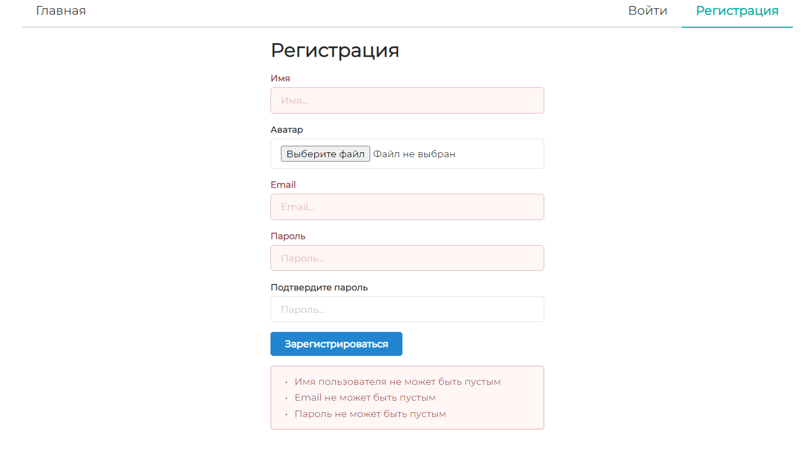
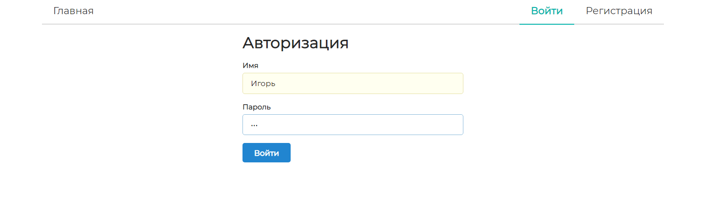
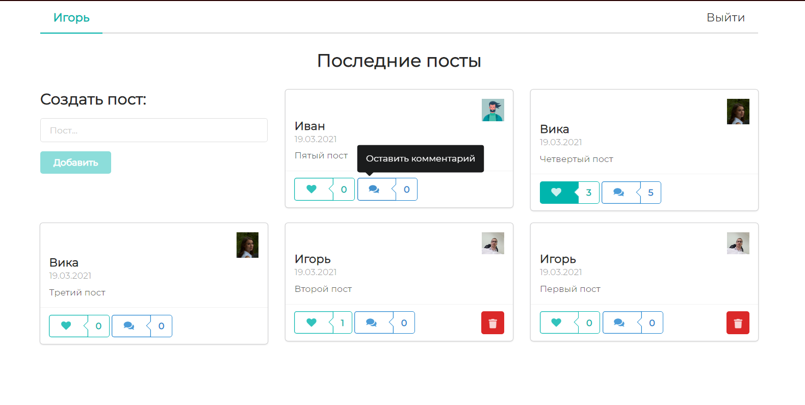
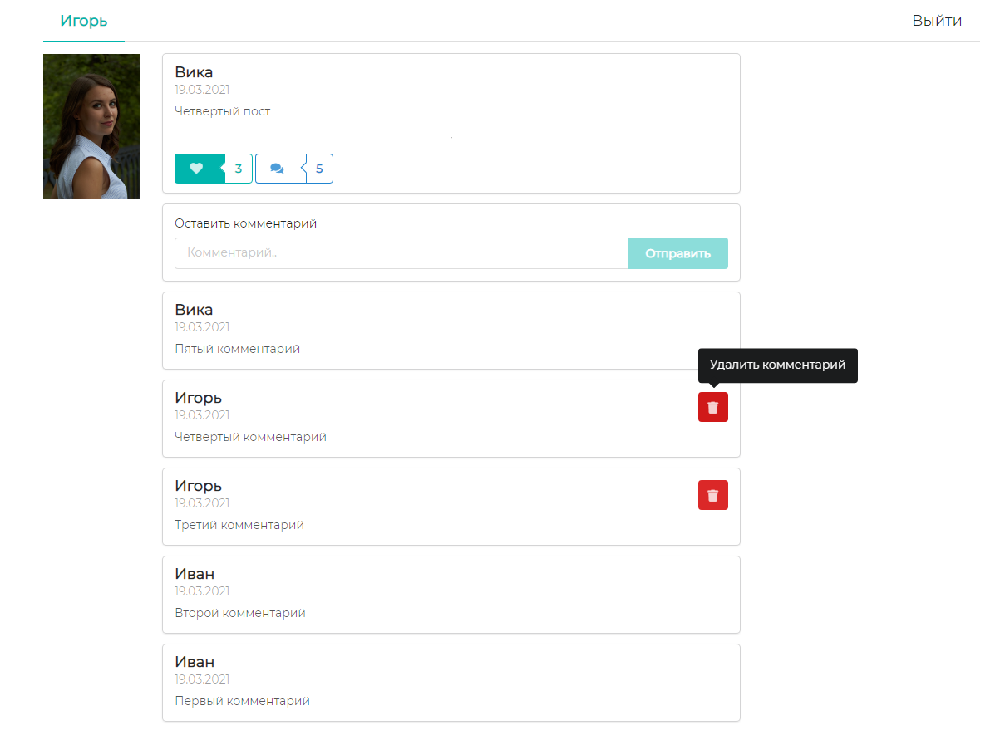
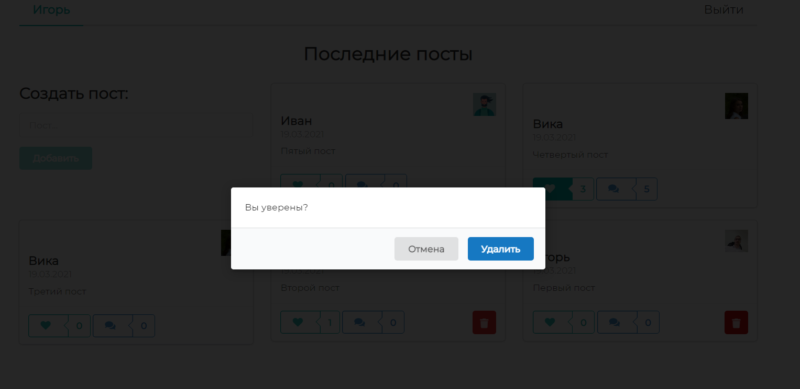
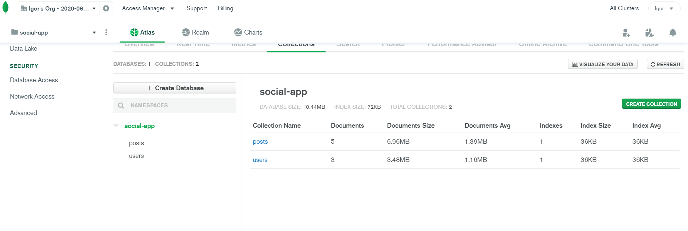

# React Social App :metal:

> Каждая строка кода снабжена подробным комментарием

Проект представляет собой расшифровку и доработку <a href="https://www.youtube.com/watch?v=n1mdAPFq2Os">этого замечательного туториала</a>

## Основные возможности приложения

- Регистрация/авторизация пользователей
- Добавление/удаление постов
- Лайк/дизлайк постов
- Добавление/удаление комментариев к постам
- Отображение количества лайков и комментариев

## Стек

*Сервер*:

- Apollo Server
- GraphQL + GraphQL Tag
- Mongoose
- JSON Web Token
- Bcrypt
- Supervisor
- Concurrently

*Клиент*:

- React
- ReactDOM
- React Router DOM
- Apollo Client
- GraphQL + GraphQL Tag
- JWT Decode
- React Loader Spinner
- Semantic UI React

## Запуск приложения

Для запуска приложения необходимо сделать следующее:
- Клонировать репозиторий

```js
git clone
```

- Установить зависимости сервера и клиента

```bash
yarn
# или
npm i

cd client

yarn
# или
npm i
```

- Создать базу данных в MongoDB Atlas (MongoDB Cloud)
- Создать файл `config.js` в корневой директории проекта (react-social-app) с MongoDB URI и "солью" для шифрования пароля

```js
module.exports = {
  MONGODB: 'mongodb+srv://<username>:<password>@cluster0.pscjo.mongodb.net/<dbname>?retryWrites=true&w=majority',
  SECRET: 'secret'
}
```

- Выполнить команду, находясь в корневой директории проекта

```bash
yarn start
# или
npm start
```

## Скриншоты приложения

Регистрация



Авторизация



Главная страница



Страница поста



Удаление поста или комментария



База данных


